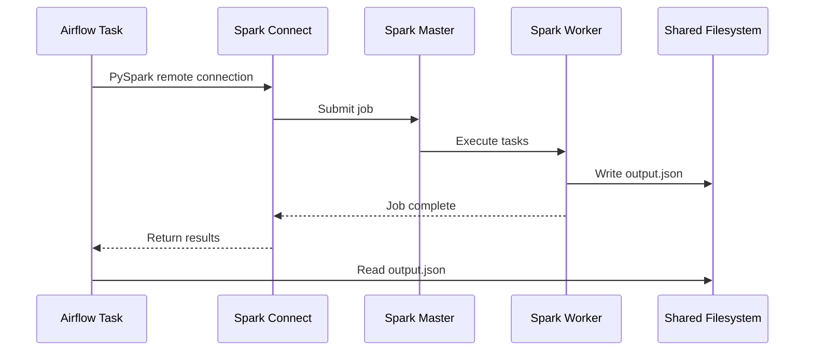

# Airflow Playground

Experimentation playground for Apache Airflow with Spark 4.0 integration.

## Quick Start

```bash
docker compose up -d --build
```

## Services

| Service | URL | Description |
|---------|-----|-------------|
| Airflow UI | http://localhost:8080 | DAG management (airflow/airflow) |
| Spark Master | http://localhost:8081 | Cluster status |
| Spark Worker | http://localhost:8082 | Worker status |
| Spark Connect | grpc://localhost:15002 | gRPC endpoint |

## DAGs

### 1. User Processing
**Purpose**: Learn Airflow fundamentals

Simple ETL pipeline demonstrating:
- Sensors and API calls
- TaskFlow API
- PostgreSQL integration

### 2. Spark Processing  
**Purpose**: Run Spark jobs via Spark Connect

```
Airflow Task --> Spark Connect (gRPC) --> Spark Cluster --> Shared Filesystem --> Next Task
```

**Architecture:**



**Key Configuration:**
- PySpark client version must match Spark server (`pyspark[connect]==4.0.0`)
- No Spark binaries needed in Airflow container
- Uses gRPC protocol on port 15002

## Verification

```bash
# Check all services
docker compose ps

# Verify Spark output
cat spark/data/output.json

# View Spark Connect logs  
docker compose logs spark-connect --tail 20
```

## Troubleshooting

| Issue | Solution |
|-------|----------|
| Permission denied on logs | `sudo chown -R $(id -u):0 logs/` |
| Version mismatch error | Pin `pyspark==4.0.0` to match server |
| DAG not appearing | Check `docker compose logs airflow-dag-processor` |

## Resources

- [Airflow Providers](https://registry.astronomer.io/providers)
- [Spark Connect](https://spark.apache.org/docs/latest/spark-connect-overview.html)
